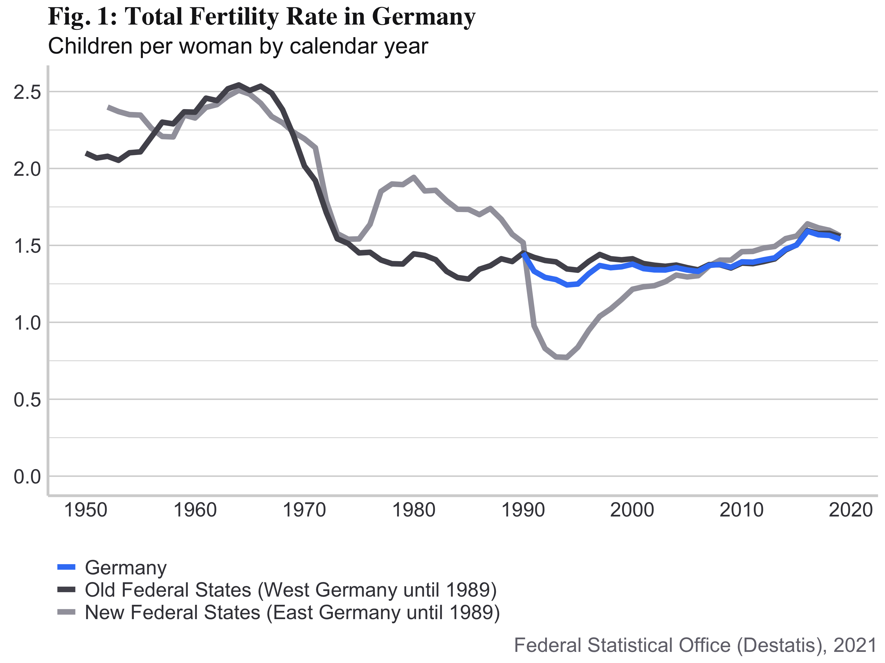
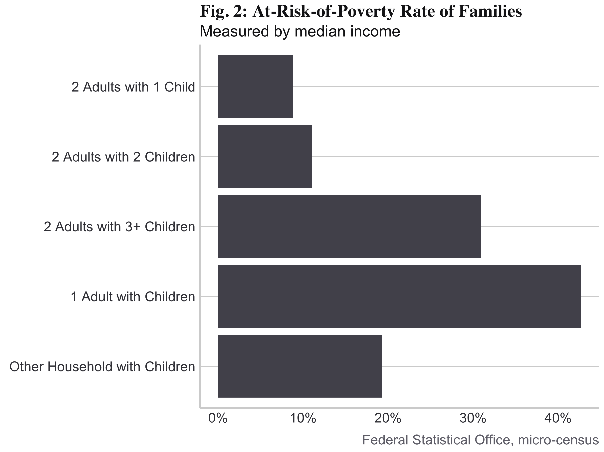
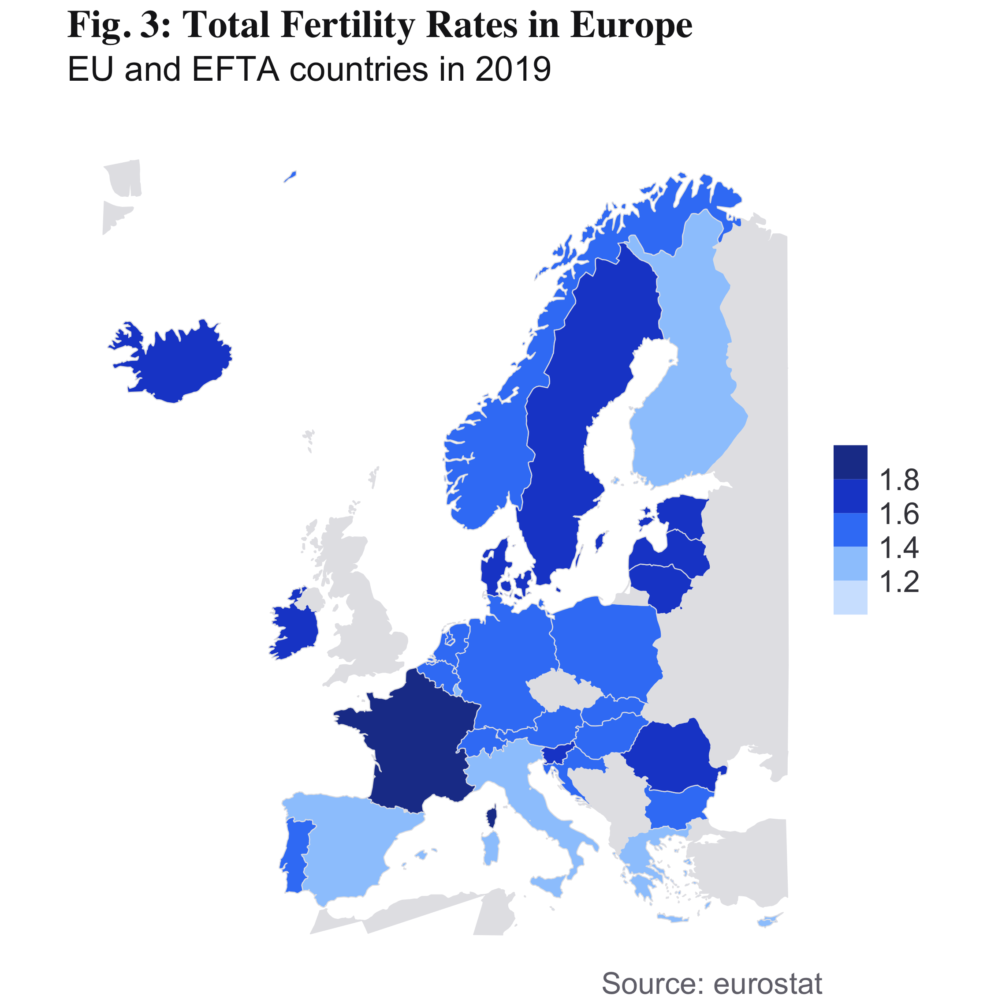

# Demographic Change in Germany—A Case Study

A low birth rate and rising life expectancy are fueling demographic change in Germany. These trends pose economic challenges such as a dwindling labor force and the underfunding of social security systems. As a result, lawmakers must re-evaluate existing public policies and design new solutions. This case study provides data visualizations supporting the exploration and evaluation of policy options to solve these demographic problems.

## Visualizations

A visualization of the average live births per woman over time. The data is grouped by region: Federal Republic of Germany, former territory of the Federal Republic, former territory of East Germany.

    

    

    
</p

Check out a detailed implementation of the visualizations in `notebook.pdf`.

## References

I used data from the following sources:

Eurostat. (n.d.). _Total fertility rate_. Retrieved April 9, 2021, from [https://ec.europa.eu/eurostat/databrowser/view/tps00199/default/table?lang=en](https://ec.europa.eu/eurostat/databrowser/view/tps00199/default/table?lang=en)

Federal Statistical Office (Destatis). (2020a, July 29). _Completed cohort fertility_. Retrieved April 9, 2021, from [https://www.destatis.de/EN/Themes/Society-Environment/Population/Births/Tables/female-cohorts.html](https://www.destatis.de/EN/Themes/Society-Environment/Population/Births/Tables/female-cohorts.html)

Federal Statistical Office (Destatis). (2020b, August 13). _Armutsgefährdungsquote gemessen am Bundesmedian nach Haushaltstyp_. Retrieved April 9, 2021, from [https://www.destatis.de/DE/Themen/Gesellschaft-Umwelt/Soziales/Sozialberichterstattung/Tabellen/06agq-zvbm-haushaltstyp.html](https://www.destatis.de/DE/Themen/Gesellschaft-Umwelt/Soziales/Sozialberichterstattung/Tabellen/06agq-zvbm-haushaltstyp.html)
